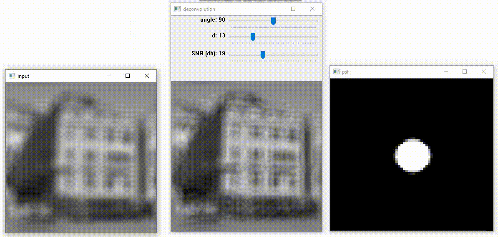
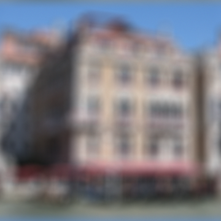
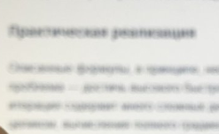
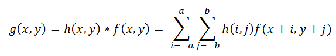
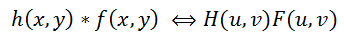
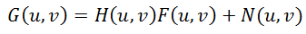



# Image recovery
Recover blurry images using Weiner deconvolution of an image with user-defined point spread function (PSF)

*How use?*
```python
python wiener_deconvolution.py <image_input>
``` 
Use sliders to adjust PSF paramitiers:

    -angle in degrees 
    -diameter object PSF
    -SNR - signal/noise ratio in db

 *Keys:*
    
    SPACE - switch btw linear/cirular PSF
    ESC   - exit

*Example № 1 witn cirular PSF*



*Example № 2 witn linear PSF*


## Теория
---

`	`Восстановление искаженных изображений является одной из наиболее интересных и важных проблем в задачах обработки изображений – как с теоретической, так и с практической точек зрения. 

`	`Помимо таких вещей как шум, неправильная экспозиция, дисторсия есть и более серьезные проблемы: 

- размытие из-за неправильного фокуса  
- смаз – дефекты

 



Не стоит отчаиваться, если мы видим такие изображения, все дело в том, что наша информация не теряется где-то, а просто перераспределяется по некоторому закону и может быть однозначно восстановлена с некоторыми оговорками. Исключение составляет лишь края изображения шириной в радиус размытия – там полноценное восстановление невозможно.

Будем рассматривать только полутоновые черно-белые изображения в предположении, что для обработки полноцветного изображения достаточно повторить все необходимые шаги для каждого из цветовых каналов RGB.

*Пусть:*

    -f(x, y) – исходное неискаженное изображение
    -h(x, y) – искажающая функция
    -n(x, y) – аддитивный шум
    -g(x, y) – результат искажения, т.е. то, что мы наблюдаем в результате (смазанное или расфокусированное изображение)

Сформулируем модель процесса искажения следующим образом:

    g(x, y) = h(x, y) \* f(x, y) + n(x, y) 

`	`Задача восстановления искаженного изображения заключается в нахождении наилучшего приближения f'(x, y) исходного изображения

`	`В процессе искажения каждый пиксель исходного изображения превращается в пятно для случая расфокусировки и в отрезок для случая простого смаза.

Что такое h(x,y)?

`	`То, по какому закону размазывается или собирается один пиксель и называется функцией искажения. Другие синонимы – PSF (Point spread function, т.е. функция распределения точки), ядро искажающего оператора, kernel и другие.

`	`Операция применения искажающей функции к другой функции (к изображению, в данном случае) называется сверткой (convolution), т.е. некоторая область исходного изображения сворачивается в один пиксель искаженного изображения. Обозначается через оператор «\*». Математически для изображения f с размерами M x N и искажающей функции h c размерами m x n это записывается так:



`	`Осталось рассмотреть последнее слагаемое, отвечающее за шум, n(x, y) в формуле. Причины шума в цифровых сенсорах могут быть самыми разными, но основные это – тепловые колебания и темновые токи. На величину шума также влияет ряд факторов, таких как значение ISO, тип матрицы, размер пикселя, температура, электромагнитные наводки и пр. В большинстве случаев шум является Гауссовым (который задается двумя параметрами – средним и дисперсией), а также является аддитивным, не коррелирует с изображением и не зависит координат пикселя.

## **Итак: нам необходимо каким-то образом обратить свертку, при этом не забывая про шум.**

`	`На помощь к нам приходит преобразование Фурье. Есть такая теорема о свертке, которая гласит, что операция свертки в пространственной области эквивалентна обычному умножению в частотной области (причем умножение поэлементное, а не матричное).

Соответственно, операция обратная свертке эквивалентна делению в частотной области, т.е. это можно записать как: 

Где H(u, v), F(u, v) – Фурье-образы соответствующих функций. Значит процесс искажения из формулы (1) можно переписать в частотной области как:



`	`Как в этом случае избавиться от шума чтобы выполнить обратную свертку, деконволюцию?

`	`Есть подходы, которые учитывают наличие шума на изображении – один из самых известных и самых первых, это **фильтр Винера (Wiener)**. Он рассматривает изображение и шум как случайные процессы и находит такую оценку f' для неискаженного изображения f, чтобы среднеквадратическое отклонение этих величин было минимальным.

## Ход работы:

1. Считываем изображение, нормализуем, делаем размытие краев, делаем преобразования Фурье.
```python
img = cv2.imread(fn, 0)
if img is None:
print('Failed to load fn:', fn)
sys.exit(1)
img = np.float32(img) / 255.0
cv2.imshow('input', img)
img = blur\_edge(img)
IMG = cv2.dft(img, flags=cv2.DFT\_COMPLEX\_OUTPUT)
```

2. Выводим на экран изображение и ползунки для изменения параметров: угол наклона функции распределения точки, диаметр PSF, SNR – отношение изображения к шуму. 

`	`Есть возможность исправить два вида изображений: размытие и смаз, размытие убирается, используя PSF в виде окружности, а смаз исправляется, используя PSF в виде линии. Переключать между этими функциями можно через клавишу Space. Первым ползунком мы регулируем угол наклона линии в PSF. Вторым ползунком изменяем диаметр фигуры в PSF. Третьим ползунком меняем SNR – величина отношения данных изображения к шуму. 

```python
cv2.namedWindow(win)
cv2.namedWindow('psf', 0)
cv2.createTrackbar('angle', win, 135, 180, update)
cv2.createTrackbar('d', win, 22, 50, update)
cv2.createTrackbar('SNR (db)', win, 25, 50, update)
update(None)
```

3. Обновляем картинку при изменении любых параметров. 

```python
def update(\_):
    ang = np.deg2rad(cv2.getTrackbarPos('angle', win))
    d = cv2.getTrackbarPos('d', win)
    noise = 10 ** (-0.1 * cv2.getTrackbarPos('SNR (db)', win))

    if defocus:
        psf = defocus_kernel(d)
    else:
        psf = motion_kernel(ang, d)
    cv2.imshow('psf', psf)
    psf /= psf.sum()
    psf_pad = np.zeros_like(img)
    kh, kw = psf.shape
    psf_pad[:kh, :kw] = psf
    PSF = cv2.dft(psf_pad, flags=cv2.DFT_COMPLEX_OUTPUT, nonzeroRows=kh)  # дискретное преобразование Фурье
    PSF2 = (PSF ** 2).sum(-1)
    iPSF = PSF / (PSF2 + noise)[..., np.newaxis]
    RES = cv2.mulSpectrums(IMG, iPSF, 0)
    # поэлементное умножение двух комплексных матриц, которые являются результатом действительного или комплексного преобразования Фурье. Ну или свертка.
    res = cv2.idft(RES, flags=cv2.DFT_SCALE | cv2.DFT_REAL_OUTPUT)
    # Вычисляет обратное дискретное преобразование Фурье для одномерного или двухмерного массива.
    res = np.roll(res, -kh // 2, 0)
    res = np.roll(res, -kw // 2, 1)
    cv2.imshow(win, res)
```
